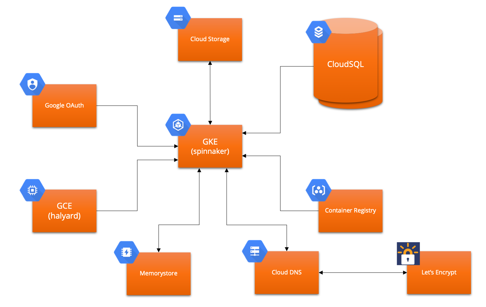

# Spingo
A collection of Terraform and bash scripts to setup an enterprise-grade Spinnaker deployment on Google Cloud Platform

## Architecture



## Prerequisites

- [Vault](https://www.vaultproject.io/downloads.html) needs to be setup and authenticated
	- VAULT_ADDR environment variable should be setup pointing to the vault server
	- Or on OSX with homebrew it's `brew install vault`
	- A local vault initialization can be done by from scripts/local_vault_setup.sh
- [Google Cloud SDK](https://cloud.google.com/sdk/install) should be setup and authenticated
	- Be sure to run both `gcloud auth login` and `gcloud config set project <YOUR_PROJECT_ID>`
	- You will need to be an owner of the GCP project to grant all the permissions required for Terraform to create all the resources needed
- [Terraform](https://www.terraform.io/downloads.html) should be setup
	- Or on OSX with homebrew it's `brew install terraform`

## Setup

### Initialize

```sh
git clone https://github.com/homedepot/spingo.git
cd spingo
./scripts/initial_setup.sh
```

### Setup Managed DNS through Cloud DNS

```sh
cd dns
# Initialize Terraform against newly created bucket
terraform init
terraform apply
```

After the managed DNS is setup you now need to direct the DNS hostname to the proper nameservers. First, navigate to [the managed DNS zone that was just setup](https://console.cloud.google.com/net-services/dns/zones/spinnaker-wildcard-domain) and note the name servers listed under the data for the NS type record (it should look like ns-cloud-c1.googledomains.com and ns-cloud-c2.googledomains.com etc. and there should be 4 of them). You then need to log into your domain hosting provider and direct the owned domain to these name servers so that traffic can be routed to your project and SSL certificates can be requested through the [Let's Encrypt](https://letsencrypt.org/) Google domain authentication plugin which adds a TXT record to the domain to prove that it is owned by you.

Once Google Cloud DNS is properly getting traffic you will be able to complete the Let's Encrypt SSL configuration.

```sh
cd ..
```

### Setup Static IP addresses

Just like with DNS Managed Zones, we are separating the generation of static IPs out from the 'spinnaker/' tree to it's own self-contained area. This is necessary in order to allow for a terraform destroy of the spinnaker resources and not lose static IPs because they persist in external things like firewall rules and it's non-trivial to update those.

```sh
cd static_ips
# Initialize Terraform against newly created bucket
terraform init
terraform apply
cd ..
```

### Setup Spinnaker Infrastructure

```sh
cd spinnaker
# Initialize Terraform against newly created bucket
terraform init
terraform apply
```

#### Google OAuth Authorization Setup

At the very end of the Setup Spinnaker Infrastructure step you will see an output called `spinnaker_fiat_account_unique_id` with a very large number printed out. That number is the unique ID of the Spinnaker service account `spinnaker-fiat` whose ID we need to use as the `Client Name` in step #3 when we follow [these instructions](https://www.spinnaker.io/setup/security/authorization/google-groups/#service-account-setup) to enable read-only permissions to get all the groups that a user has at the organization level. Many large enterprises sync their active directory groups to their Google user accounts and we want to utilize that to enable true Role Based Authentication (RBAC) within Spinnaker to separate authorizations between different applications and between different deployment targets.

```sh
cd ..
```

### Setup Halyard VM

#### Google OAuth Authentication Setup

- Navigate to the [APIs & Services > Credentials](https://console.cloud.google.com/apis/credentials/consent) and set your `Application name` and your `Authorized domains`
- Navigate to [Create OAuth client ID](https://console.cloud.google.com/apis/credentials/oauthclient) and choose `Web application` then enter the `Name` like `spinnaker client ID` and the `Authorized redirect URIs` to your HTTPS url like this (note the `/login` at the end of each
	- `https://spinnaker-api.demo.example.com/login`
- Write your new OAuth client ID and client secret into vault
	- You can enter the details directly through this command	`vault write secret/$(gcloud config list --format 'value(core.project)' 2>/dev/null)/gcp-oauth "client-id=replace-me" "client-secret=replace-me"`
	- Alternatively, you may be able to use the vault UI and enter the information to the same location and replace anything where the value is `replace-me`

#### If you are going to use Slack integration (skip to next section if not)

- Create a [Slack Bot App](https://api.slack.com/apps) within your Slack workspace and call it `spinnakerbot`
- Under the `OAuth & Permissions` section make sure that the `bot` scope is listed under interactivity and copy your `Bot User OAuth Access Token`
- Write your new `Bot User OAuth Access Token`
	- You can enter the details directly through this command	 `vault write secret/$(gcloud config list --format 'value(core.project)' 2>/dev/null)/slack-token "value=replace-me"`
	- Alternatively, you may be able to use the vault UI and enter the information to the same location and replace anything where the value is `replace-me`

#### Certbot SSL through [Let's Encrypt](https://letsencrypt.org/)

```sh
cd certbot
# Initialize Terraform against newly created bucket
terraform init
terraform apply
```

- SSH into the [certbot VM](https://console.cloud.google.com/compute/instances)
- Enter this command to make sure the setup is complete `showlog`
- Once completed, log into the user account by entering this command `spingo`
- Test create a certificate by executing this script `./execute-test.sh`
- When you are ready to create the certificate for real then execute this script `./execute-only-if-you-are-sure.sh`
- When you have successfully recieved certificates you then execute `./make_or_update_keystore.sh`
- Finally, you run the command `pushcerts` to push the certs back up to the halyard bucket
- You no longer need the certbot VM anymore so destroy it

```sh
terraform destroy
cd ..
```

#### It's Halyard Time!

```sh
cd halyard
# Initialize Terraform against newly created bucket
terraform init
terraform apply
```

- SSH into the [halyard VM](https://console.cloud.google.com/compute/instances)
- Enter this command to make sure the setup is complete `showlog`
- Once completed log into the user account by entering this command `spingo`
- Setup Halyard and deploy Spinnaker for the first time by executing `./setupHalyard.sh` which will setup all clusters
- Once the deployment(s) is/are successful the next step is to setup SSL by executing `./setupSSL.sh`
- Navigate to your new Spinnaker by going to `https://spinnaker.demo.example.com` and replacing `demo.example.com` with whatever domain you entered into the initialization script

### Setup Monitoring and Alerting

Follow the instructions [here](monitoring-alerting) to setup basic monitoring and alerting of the Spinnaker deployments

## Restore saved values from vault

If you have previously run `scripts/initial_setup.sh`, and are in a situation where this is a new machine or otherwise a fresh clone of the repo, you can restore the saved values from vault by running:

```sh
scripts/restore_saved_config_from_vault.sh
```

## Teardown

If you want to completely destroy the installation:

1. `terraform destroy` all of the subdirectories in the reverse-order that you ran `terraform apply`
1. execute `scripts/reset_spingo.sh`

`scripts/reset_spingo.sh` is designed to remove the service accounts that terraform requires.

## Contributing

Check out the [contributing](CONTRIBUTING.md) readme for information on how to contribute to the project.

## License

This project is released under the Apache2 free software license. More information can be found in the [LICENSE](LICENSE) file.
